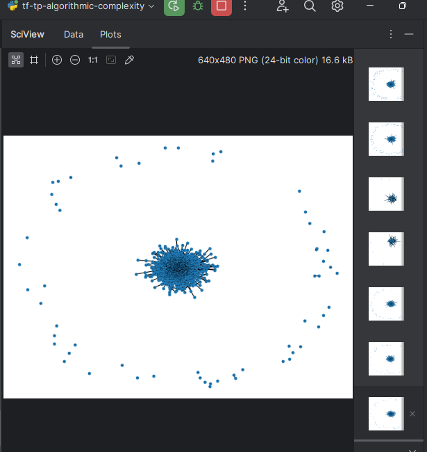
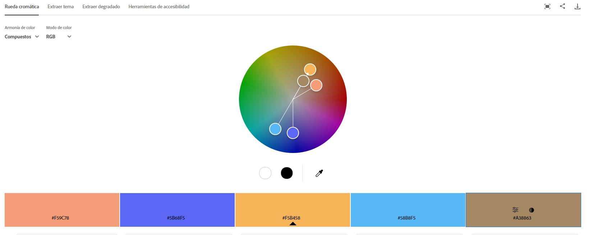
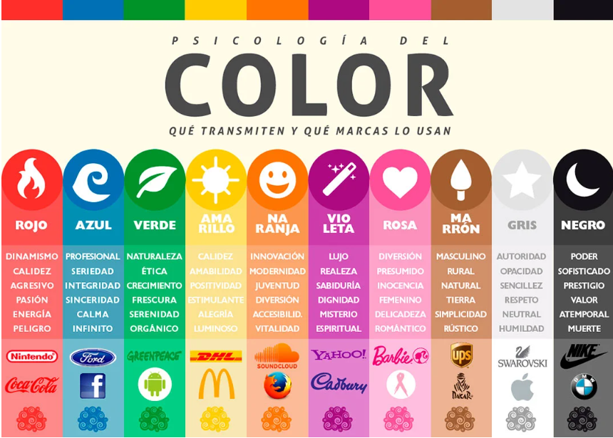
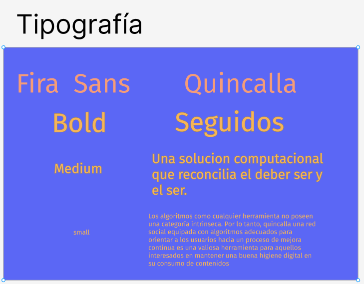
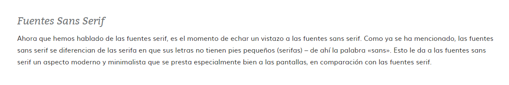

<br />
<div align="center">
  <a href="https://github.com/H4RRY73/tf-algorithmic-complexity">
    
  </a>

  <h1 align="center">Quincalla</h1>

  <p align="center">
    Peruvian University of Applied Sciences.
    <br />
    Algorithmic Complexity.
    <br />
    Teacher: Luis Martin Canaval Sanchez
  </p>
</div>

**_Integrantes_**
| Apellidos y Nombres | Codigo |
| ------------- | ------------- |
| Cervantes Erequita  | U202110140  |
| Mayta Lopez Harold Jaime | U202114851  |
| Vilchez Marin Rody Sebastian | U202112321 |

## Descripcion del problema
### Contextualizacion
---
> Cuando realizas una búsqueda en Google como 'el cambio climático es...', obtendrás resultados diversos, dependiendo de tu ubicación y de la información que Google tenga sobre tus intereses.
- Netflix, 2020.

Este es el punto de partida de **The Social Dilemma**, un documental que investiga los efectos y peligros vinculados al uso de diversos servicios en línea. En este documental, se pone de relieve cómo los algoritmos utilizados pueden tener un impacto significativo en la política global, como se evidenció durante la *Primavera Árabe*. No obstante, no debemos menospreciar el impacto y la influencia personal que estos algoritmos ejercen sobre los usuarios.

No es sorprendente que ***Stuart Russell***(**2021**), profesor de Inteligencia Artificial en la Universidad de California en Berkeley, expresara en una entrevista con la BBC: *El objetivo principal de estos algoritmos es mejorar la experiencia del usuario en las redes sociales, logrando recopilar la máxima cantidad de información sobre cada usuario y proporcionándoles contenido que se adapte a sus preferencias para mantenerlos conectados por más tiempo*.

### Descripcion del problema
De manera lógica, podemos inferir que el uso de servicios que emplean algoritmos como los mencionados por Russell no guía a los usuarios hacia una mejora constante, sino que los sumerge en un proceso en el que cada vez destinan más tiempo a consumir contenido, en una dinámica poco saludable.

Como grupo, consideramos que los algoritmos como cualquier herramienta no poseen una categoría moral en si mismas, siendo que la categoria moral aplica exclusivamente al uso que se les da.  Por lo tanto, creemos que una red social equipada con algoritmos adecuados para orientar a los usuarios hacia un proceso de mejora continua podría ser una valiosa herramienta para aquellos interesados en mantener una buena higiene digital en su consumo de contenidos.

En este sentido, nustro objetivo frente a este problema es crear una una solucion computacional que reconcilie frente al usuario *lo que es* y *lo que quiere ser*.

## Descripción del conjunto de datos **dataset**

En cuanto a las siguientes criterios de selección del conjunto de datos **dataset**, necesitamos que este cumpla con los siguientes requisitos:


* Identificador Unico: Cada usuario debe contar con un identificador unico, ademas de sus respectivas credenciales de incio de sesion.

* Datos basicos : Cada usuario debe contar con datos basicos para la construccion de su perfil. 

* Lista relacional : El dataset debe contener algun tipo de información que realcione 2 usuarios (seguidos, seguidores, amigos, etc.).

* Criterios Parametrizables:  Seria bastante beneficioso **para el cumplimiento de los objetivos** que el dataset incluya criterios parametrizables.

* Mas de 1500 registros: El dataset debe contar con al menos 1500, para asegurar que haya suficientes nodos para simular cierta carga.

[Airline Dataset](https://www.kaggle.com/datasets/iamsouravbanerjee/airline-dataset) 

Es un dataet colaborativo que cuenta con diversa informacion sobre pasajeros de aerolines. 
Creado por Sourav Banerjee (2023) y obtenido mediante Kaggle. Contiene, entre otros campos; nombre
apellido, genero, edad y nacionalidad.

Para la primera entrega se modifico de la siguiente manera:
1) Genera un ID unico para cada registro
2) Almacena el nombre, apellido, genero y edad como cadenas de texto
2) Genera un correo teniendo como base estos datos
3) Genera una contrasena numerica pseudoaleatoria
4) Marca de forma pseudoaleatoria algunos intereses en una binaryList
5) Por ultimo se genera una lista de seguidos entre los registros existentes

De este modo el archivo ***persona.json*** cuenta con 98, 619 registros.


[TwitterFriends](https://www.kaggle.com/datasets/hwassner/TwitterFriends)


En la misma plataforma encontramos el dataset [Twitter Friends](https://www.kaggle.com/datasets/hwassner/TwitterFriends). Este dataset cuenta con:

* ID de usuario: Identificador unico para cada usuario. Fungira como identificador de los nodos.

* Lista de Amigos: Almacenados en forma de ID de usuario. Servira para realacionar los nodos.

* Tiempo desde el ultimo Tweet: Parametrizable tras procesar como actividad del usuario.

* Seguidores: Parametrizable a socializacion. Interes generado por el user.

* Seguidos: Parametrizable a socializacion. Intereses del user.

Como ultimas ventajas a mencionar, por un lado es la cantidad de registros, contando con 40 000 registros. Por otro lado, la escalabilidad de este dataset al poder ser reemplazado en entregas posteriores por la API de twitter.

Finalmente, reconocer a ***Hubert Wassner*** (**2016**) creador de este dataset mediante la utilizacion de la API pública de Twitter.

## Propuesta
Como respuesta a esta problematica se encontrara **Quincalla** una red social con dos posibilidades de carga de contenido.
El primer tipo de carga de contenido es bastante similar al tradicional donde se buscaria retener el maximo tiempo al usuario
mediante un contenido disenado de acuerdo a su perfil y comportamientos *(lo que es)*. El segundo tipo de carga seria de 
acuerdo a las metas o intereses seleccionados por el usuario, donde se rodeara de gente y contenidos de acuerdo a sus 
propositos u objetivos *(lo que quiere ser)*. Sobra decir que el primer modo es meramente para mostrar al usuario que
tan lejos o cerca esta de sus objetivos *(su estado actual)*.

### Objetivo General
* Nuestro objetivo general es crear una red social que, a través del contenido mostrado y las interacciones realizadas, permita guiar al usuario desde su situación actual hacia la consecución de sus metas y aspiraciones, 

### Objetivos Especificos
* Implementar una aplicacion que permita mostrar contenido afin al comportamiento actual del usuario.

* Implementar en la aplicacion un ajuste que permita mostrar contenido afin a los objetivos expresados por el usuario.

### Metodologia 
---
> El pensamiento Lean ... tiene como objetivo garantizar el incremento del valor de un producto/servicio reduciendo el desperdicio en el proceso de creación de este, mejorando la calidad.
- Villanueva y Vizarreta, 2022, p60.


La metodologia a emplear en este trabajo sera LEAN UX, dada la intensidad, e iteracion propuestas para el desarrollo de este proyecto. Asimismo, consideramos que el enfoque solucionador de esta metodologia sera frecuentemente util.

### Tecnicas
* ***Segun describe Flores*** (**2022**), la metodologia Lean UX sugiere que trabajar para alcanzar un MVP (producto minimo viable) e iterar con sprints sobre el.

* Segun las recomendaciones realizadas por ***Canaval** (**comunicación personal, 15 de agosto de 2023**) usaremos el analisis de tiempos Para poder predecir o validar, comportamientos del programa conforme la cantidad de usuarios crezca. La prediccion se realizara con el metodo formal de conteo y la validacion con el metodo de cronometrado. 

## Diseño aplicativo
para este proyecto se espera contar con el uso de ciertos algoritmos para resolver distintos problemas dentro del programa, a continuacion se presentaran estos y su funcion dentro del contexto de una red social.

| Algoritmo | Función |
|---------------------|--------------------------------------------------------------------------------------------------------|
| Backtracking        | Buscar conexiones indirectas de grado 2 por cada usuario para poder recomendarles dichas conexiones |
| Divide y venceras   | Navegar a través de un arbol binario para ubicar a un grupo de usuarios basandose en una lista binaria propia de cada usuario|
| UFDS | Poder identificar componentes conexos dentro del grafo de usuarios y contenido con el fin de poder identificar coincidencias y poder recomendarlas |
| Programacion dianmica| Poder detectar comunidades basandose en intereses similares e incluso conexiones similares aplicando el algoritmo en el grafo de usuarios |


## Aplicacion de lo aprendido 

### Backtracking

```python
def recomendar_conexiones(self, correo):
    visitados = set()
    conexiones_directas = self.buscar_conexiones(correo)
    recomendaciones = []

    for conexion_directa in conexiones_directas:
        visitados.add(conexion_directa.correo)  # Agregar el correo a visitados
        self._recomendar_conexiones_backtracking(conexion_directa, correo, visitados, recomendaciones)

    # Eliminar conexiones directas y el propio usuario de las recomendaciones
    recomendaciones = [recomendacion for recomendacion in recomendaciones if recomendacion.correo != correo and recomendacion not in conexiones_directas]

    return recomendaciones

def _recomendar_conexiones_backtracking(self, conexion, correo, visitados, recomendaciones):
    for siguiente_conexion in self.buscar_conexiones(conexion.correo):
        if siguiente_conexion.correo not in visitados:  # Comprobar el correo en lugar del objeto
            visitados.add(siguiente_conexion.correo)  # Agregar el correo a visitados
            self._recomendar_conexiones_backtracking(siguiente_conexion, correo, visitados, recomendaciones)
            recomendaciones.append(siguiente_conexion)
            if len(recomendaciones) >= 10:  # Limitar el número de recomendaciones
                return
```
### Divide y venceras 

```python
def buscar_objetos_por_lista_binaria(self, lista_binaria):
    def buscar_nodos(nodo_actual, indice):
        if nodo_actual is None:
            return []

        objetos_coincidentes = []

        if indice == len(lista_binaria):
            # Llegamos al final de la lista binaria, incluir todos los objetos del nodo actual
            objetos_coincidentes.extend(nodo_actual.objetos)
        else:
            bit = lista_binaria[indice]
            if bit == 1:
                objetos_coincidentes.extend(buscar_nodos(nodo_actual.hijo_izquierdo, indice + 1))
            objetos_coincidentes.extend(buscar_nodos(nodo_actual.hijo_derecho, indice + 1))

        return objetos_coincidentes

    return buscar_nodos(self.raiz, 0)
```
### Visualizacion

 <a href="https://github.com/H4RRY73/tf-algorithmic-complexity">
    
  </a>


## UI Design
Quincalla busca ser una red social con un verdadero y manifiesto interes por sus usuarios por ello el espacio que busca 
brindar es calmo e integro, aunque a la vez innovador.


### Gana Cromatica
 <a href="https://github.com/H4RRY73/tf-algorithmic-complexit~~y">
    
  </a>~~
 *Justificacion*
<a href="https://github.com/H4RRY73/tf-algorithmic-complexity">
    
  </a>
Profesional, serio, integro, calmo, con un toque de innovacion y vitalidad, incluso  natural y simple.

### Tipografia
<a href="https://github.com/H4RRY73/tf-algorithmic-complexity">
    
  </a>
 *Justificacion*
<a href="https://github.com/H4RRY73/tf-algorithmic-complexity">
    
  </a>
    Con un aspecto moderno y minimalista, facil de leer en las pantallas y en concoordancia con los valores de la pagina.    

### Bibliografias 

1. Netflix. (2020) *The social Dilema* (Youtube) [Link](https://www.youtube.com/watch?v=uaaC57tcci0)

1. Russell, S.(2021) *Por qué los algoritmos de las redes sociales son cada vez más peligrosos.* BBC News Mundo [Link](https://www.bbc.com/mundo/noticias-58874170 )

1. Banerjee, S (2023). Airline Dataset [link](https://www.kaggle.com/datasets/iamsouravbanerjee/airline-dataset) 

1. Wassner, H.(2016) *TwitterFriends.* [Link](https://www.kaggle.com/datasets/hwassner/TwitterFriends )

1. Villanueva, F. Vizarreta, R.(2022) *Plataforma Web para la Gestión y Despliegue del Contenido Digital del Grupo de Investigación de Métodos Computacionales Aplicado a Nanomateriales de la UNMSM Desarrollado Bajo el Marco Dual-Track Agile.* (tesis de licenciatur, **Universidad de Piura**) [Repositorio Institucional UDEP.](https://pirhua.udep.edu.pe/handle/11042/5619)

1. Condor, J. (2022). *Metodología para integrar la Experiencia de Usuario en el desarrollo de sistemas web de una entidad pública.* (tesis de licenciatura, **Universidad Cesar Vallejo**). [Repositorio Institucional de la UCV.](https://repositorio.ucv.edu.pe/bitstream/handle/20.500.12692/85437/Condor_FJG-SD.pdf?sequence=1&isAllowed=y)

1. Canaval, L. (2023). Sesión de clase - recording_2 - 15/08/2023 10:53:17 (**Blackboard**). [Blackboard](https://upc-download.obs.la-south-2.myhuaweicloud.com/2023/CC184-2302-WX73/08/20230815_288f6dde5b2a45b1ac81d8dd56a29dd0.mp4?AWSAccessKeyId=GYZ95IQQPU27KYGYXLZD&Expires=1724451425&Signature=9IlUlDYJG%2BiUNV%2FxVmlfLTKvWq4%3D)

1. Adobe(2023). Herramienta.  [Link](https://color.adobe.com/es/create/color-wheel)
1. Atractica(2018). Paleta de color. [Link](https://atractica.com/psicologia-del-color-aplicada-logotipos/)
1. Paula(2023). Qué fuente tipográfica elegir para tu libro. [Link](https://mibestseller.es/escribir-un-libro/que-fuente-tipografica-elegir/#vs)